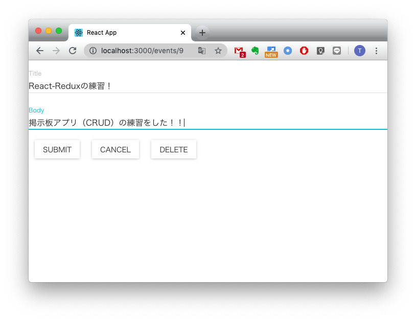

# react-learning

React-Reduxを使った掲示板アプリケーション

# DEMO


# Rquirement
* "react-redux": "^7.2.0",
* "axios": "^0.19.2",
* "material-ui": "0.20.0",
* "react": "^16.13.1",
* "react-dom": "^16.13.1",
* "react-redux": "^7.2.0",
* "react-router-dom": "^5.1.2",
* "react-scripts": "3.4.1",
* "redux": "^4.0.5",
* "redux-devtools-extension": "^2.13.8",
* "redux-form": "^8.3.5",
* "redux-thunk": "^2.3.0"

# Usage
```bash
> git clone https://github.com/T-Sumida/react-learning.git
> cd react-learning
> yarn start
```

# Author
T-Sumida

# License
[MIT license](https://en.wikipedia.org/wiki/MIT_License).
